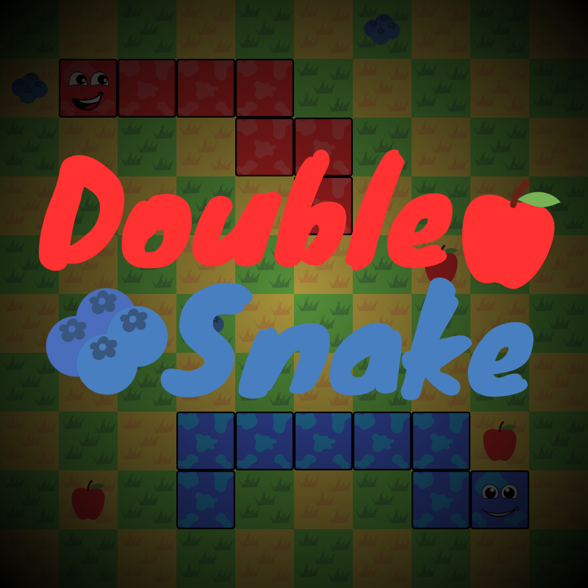

<p align="center">
  
</p>

# DoubleSnake

Ein kooperatives Snake-Spiel für zwei Spieler, entwickelt mit Node.js, Express und Socket.IO.

## 📋 Projektübersicht

DoubleSnake ist eine moderne Interpretation des klassischen Snake-Spiels für zwei Spieler. Es ermöglicht Spielern, gemeinsam in Echtzeit zu spielen und Punkte zu sammeln. Das Spiel bietet ein Lobby-System zum Erstellen und Beitreten von Spielen sowie Benutzerkonten zur Spielerverwaltung.

## 🌟 Hauptfunktionen

- **Benutzerkonten-System**: Registrierung, Anmeldung und Profilbearbeitung
- **Lobby-System**: Erstellen und Beitreten von Spielen mit eindeutigen Codes
- **Echtzeit-Multiplayer**: Simultanes Spielen mit einem Partner
- **Responsive Design**: Optimiert für Desktop und mobile Geräte

## 🛠️ Technologien

- **Frontend**: HTML, CSS, JavaScript
- **Backend**: Node.js, Express
- **Echtzeit-Kommunikation**: Socket.IO
- **Datenbank**: MySQL2
- **Authentifizierung**: Bcrypt, Express-Session

## 🚀 Installation

### Voraussetzungen
- Node.js (Version 18 oder höher)
- MySQL Server

### Schritte zur Installation

1. **Repository klonen**
   ```bash
   git clone [https://github.com/yourusername/doubleSnake.git](https://github.com/yourusername/doubleSnake.git)
   cd doubleSnake
   ```

2. **Datenbank einrichten**
   - Erstellen Sie eine MySQL-Datenbank mit dem Namen "doublesnake"
   - Importieren Sie die Datenbankstruktur aus der Datei `doublesnake.sql`

3. **Umgebungsvariablen konfigurieren** Erstellen Sie eine `.env`-Datei im Backend-Verzeichnis mit folgenden Werten:
   ```
   SESSION_KEY=IhrGeheimesSessionKey
   PORT=3000
   DB_HOST=localhost
   DB_PORT=3306
   DB_PASSWORD=IhrDatenbankPasswort
   FRONTEND_PATH=../frontend
   ```

4. **Dependencies installieren**
   ```bash
   cd backend
   npm install
   ```

5. **Server starten**
   ```bash
   npm run dev
   # oder mit Nodemon
   npm run nm
   ```

6. **Anwendung öffnen** Navigieren Sie zu `http://localhost:3000` in Ihrem Browser

## 🐳 Docker-Installation

Das Projekt enthält zwei Docker-Konfigurationen:

- **`Dockerfile`** – Für lokale Tests oder einfache Deployments.
  ```bash
  docker build -t doublesnake .
  docker run -p 3000:3000 -e DB_HOST=your-db-host -e DB_PASSWORD=your-db-password -e SESSION_KEY=your-session-key doublesnake
  ```
- **`Dockerfile.dokploy`** – Optimierte Variante für das Hosting über [Dokploy](https://dokploy.com/). Hierbei wird nur der notwendige Produktionscode in ein Debian-basiertes Node.js-Image übertragen, damit Module wie `bcrypt` ohne zusätzliche Build-Tools funktionieren.
  ```bash
  docker build -f Dockerfile.dokploy -t doublesnake-prod .
  docker run -p 3000:3000 \
    -e SESSION_KEY=your-session-key \
    -e DB_HOST=your-db-host \
    -e DB_PORT=3306 \
    -e DB_USER=your-db-user \
    -e DB_PASSWORD=your-db-password \
    doublesnake-prod
  ```

> 💡 Für Dokploy sollte die Datenbank als externer Service eingebunden werden. Die oben aufgeführten Umgebungsvariablen können direkt im Dokploy-Dashboard konfiguriert werden. Der statische Frontend-Code wird automatisch in den Container kopiert, daher ist keine zusätzliche Konfiguration für `FRONTEND_PATH` erforderlich.

## 🎮 Spielablauf

1. Registrieren Sie sich für ein Konto oder melden Sie sich an
2. Navigieren Sie zum Dashboard und wählen Sie "Lobby"
3. Erstellen Sie eine neue Lobby oder treten Sie einer bestehenden mit einem Code bei
4. Teilen Sie den generierten Code mit einem Freund
5. Sobald zwei Spieler verbunden sind, beginnt das Spiel automatisch
6. Steuern Sie Ihre Schlange, sammeln Sie Punkte und vermeiden Sie Kollisionen

## 👨‍💻 Entwicklung

Das Projekt ist in folgende Hauptkomponenten unterteilt:

- **Server**: Express und Socket.IO für HTTP- und Websocket-Kommunikation
- **Datenbank**: Benutzerkonten und -daten
- **Lobby-System**: Verwaltung von Spielräumen und Spielerzuordnung
- **Game-Engine**: Kernspielfunktionalität und -logik

## 📄 Lizenz

Dieses Projekt steht unter der MIT-Lizenz. Weitere Details finden Sie in der LICENSE-Datei.